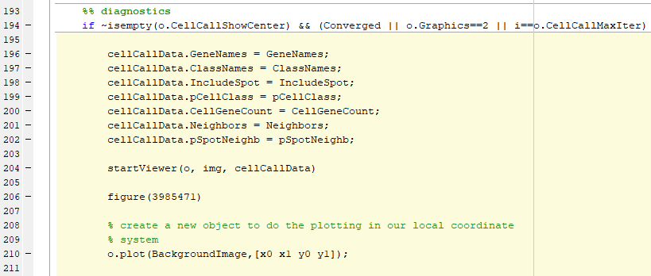

## Getting Started

These instructions will help you run the viewer from Matlab using your own images and data.

### Prerequisites
This code runs only under Windows.

A matlab object of type `iss` is needed. This has to be obtained outside the viewer, from Kenneth's Matlab code. 


### Installing
No extra dependencies are needed (apart from Matlab and Java). Everything is portable and should work as is.


### Running the viewer
* Get the folder `viewer` from the this repo:
https://github.com/acycliq/iss-1/tree/viewer (ie everything you see your on your screen, above this **README** along with the subfolders)

* Put it in the Matlab path and from the Matlab prompt `cd` into it (or any of its parent folders).

* Launch the viewer by one of the following two ways:
    * Call `startViewer(o, img)`
    where  `o` is a Matlab object of type `iss` and `img` the full path to the background image. 
    The argument `img` is optional and can be ommited, in which case (ie calling `startViewer(o)`) 
    a flat black background will be shown.
    
    * You can also call the viewer from inside the `call_cells` function, which as the name suggests runs the cell-calling algorithm. Then once 
    it converges you can construct the structure `cellCallData` and pass it in as a third argument as follows:
    
```
        cellCallData.GeneNames = GeneNames;
        cellCallData.ClassNames = ClassNames; 
        cellCallData.IncludeSpot = IncludeSpot;
        cellCallData.pCellClass = pCellClass;
        cellCallData.CellGeneCount = CellGeneCount;
        cellCallData.Neighbors = Neighbors;
        cellCallData.pSpotNeighb = pSpotNeighb;
        
        startViewer(o, img, cellCallData)
```
To do that you have to manually edit the file `call_cells.m`  and add the code snippet above so it can be called after the algorithm 
has converged. This could be for example, the line right before the first Matlab figure opens up and before this if statement: 
`if ~isempty(o.CellCallShowCenter) && (Converged || o.Graphics==2 || i==o.CellCallMaxIter)`. See image below which shows an edited snippet 
of the `call_cells` function from `@iss\call_cells.m` :
 
 
 